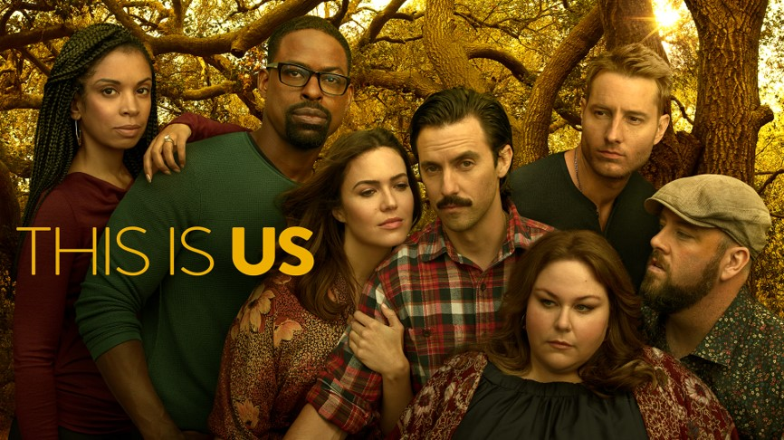
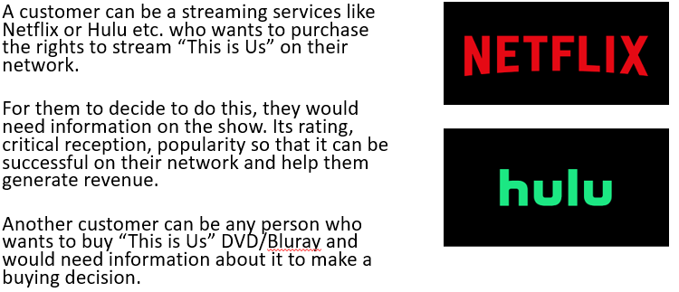
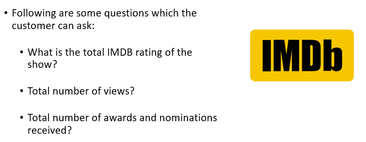
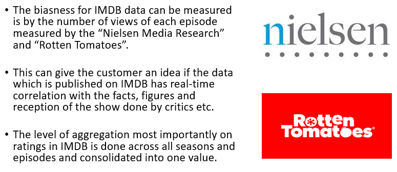
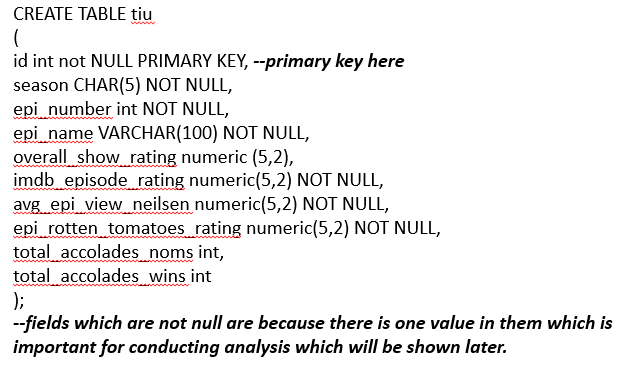
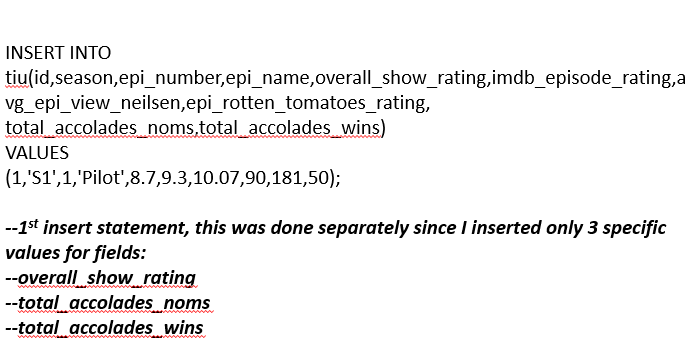
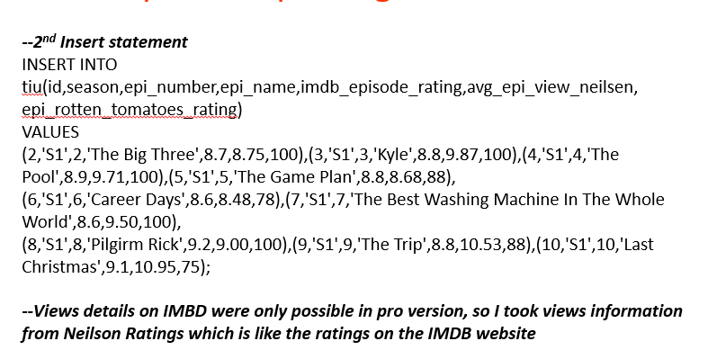
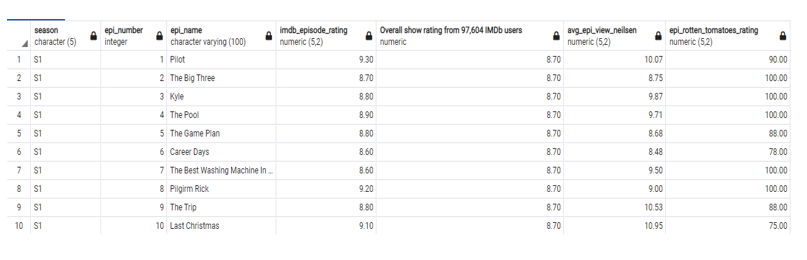
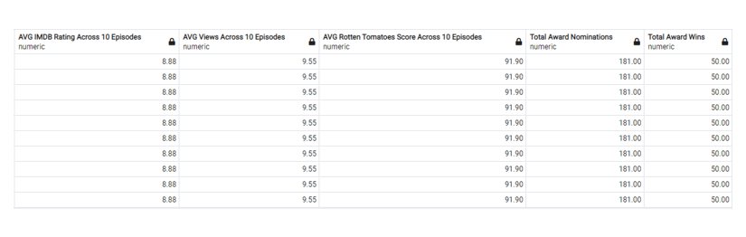
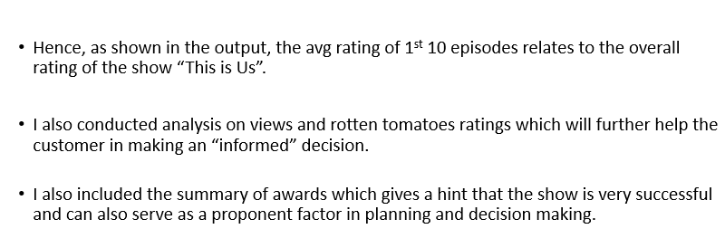

# ThisIsUs-SQL-Project

# Description:
This is a mini-project in which I created a whole new database in PostgreSQL, collected data from various resources like IMDB, Neilsen Media Research and Rotten Tomatoes to generate a statistical summary for a certain customer like "Hulu" or "Netflix" to make a buying decision for "This Is Us" TV show to telecast it on their own network. This analysis would be very important for them to make an informed decision.

Main SQL concepts used in this project are:

1. DDL (Data Definition Language)
2. DML (Data Manipulation Language)
3. DQL (Data Query Language)

# Information of Customer:

# Questions to ask of IMDB Data:

# Other sources for Reviews:

# SQL Script for Creating "TIU" Table:

# SQL Script for Populating "TIU" Table

# Statistical Summary of IMDB, Neilsen Views, Rotten Tomatoes Rating:

# Output

# Conclusion

